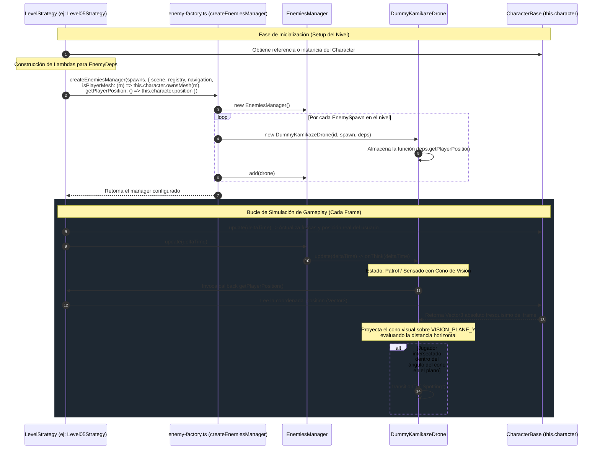

```mermaid
sequenceDiagram
    autonumber
    participant LS as LevelStrategy (ej: Level05Strategy)
    participant EF as enemy-factory.ts (createEnemiesManager)
    participant EM as EnemiesManager
    participant DKD as DummyKamikazeDrone
    participant C as CharacterBase (this.character)

    Note over LS,C: Fase de Inicialización (Setup del Nivel)
    LS->>C: Obtiene referencia o instancia del Character
    
    Note over LS: Construcción de Lambdas para EnemyDeps
    LS->>EF: createEnemiesManager(spawns, { scene, registry, navigation,<br/>isPlayerMesh: (m) => this.character.ownsMesh(m),<br/>getPlayerPosition: () => this.character.position })
    
    EF->>EM: new EnemiesManager()
    loop Por cada EnemySpawn en el nivel
        EF->>DKD: new DummyKamikazeDrone(id, spawn, deps)
        DKD->>DKD: Almacena la función deps.getPlayerPosition
        EF->>EM: add(drone)
    end
    EF-->>LS: Retorna el manager configurado

    rect rgb(30, 40, 50)
        Note over LS,C: Bucle de Simulación de Gameplay (Cada Frame)
        LS->>C: update(deltaTime) -> Actualiza físicas y posición real del usuario
        LS->>EM: update(deltaTime)
        EM->>DKD: update(deltaTime) -> onThink(deltaTime)
        
        Note over DKD: Estado: Patrol / Sensado con Cono de Visión
        DKD->>LS: Invoca callback getPlayerPosition()
        LS->>C: Lee la coordenada .position (Vector3)
        C-->>DKD: Retorna Vector3 absoluto fresquísimo del frame
        
        Note over DKD: Proyecta el cono visual sobre VISION_PLANE_Y<br/>evaluando la distancia horizontal
        alt Jugador intersectado dentro del ángulo del cono en el plano
            DKD->>DKD: transitionTo("Spotting")
        end
    end
```