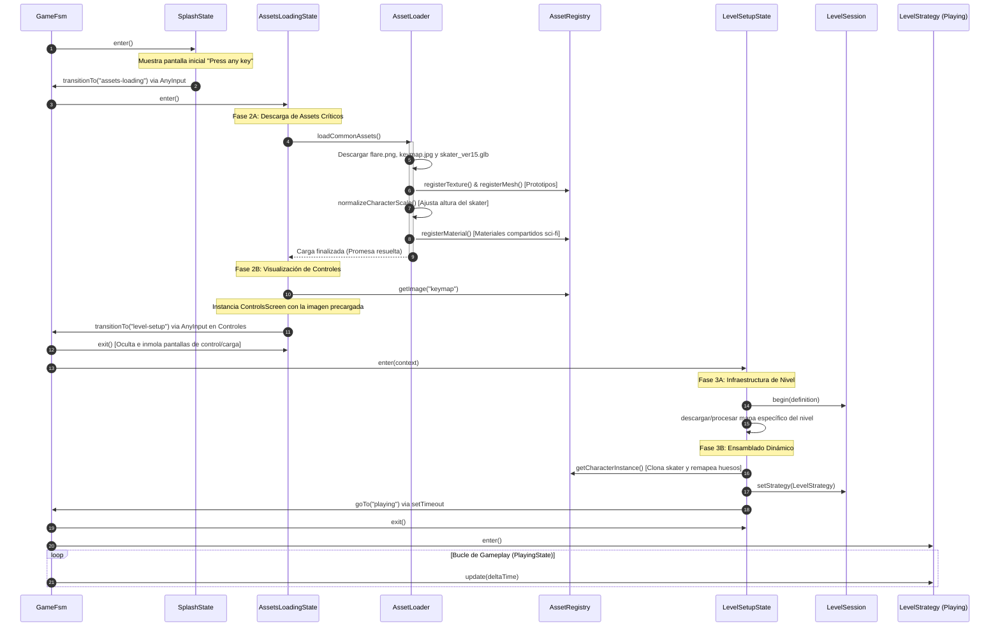

```mermaid
sequenceDiagram
    autonumber
    participant FSM as GameFsm
    participant Splash as SplashState
    participant Assets as AssetsLoadingState
    participant Loader as AssetLoader
    participant Registry as AssetRegistry
    participant Setup as LevelSetupState
    participant Session as LevelSession
    participant Strat as LevelStrategy (Playing)

    %% ESTADO 1: SPLASH
    FSM->>Splash: enter()
    Note over Splash: Muestra pantalla inicial "Press any key"
    Splash->>FSM: transitionTo("assets-loading") via AnyInput

    %% ESTADO 2: ASSETS LOADING (NUEVO CONTROL)
    FSM->>Assets: enter()
    Note over Assets: Fase 2A: Descarga de Assets Críticos
    Assets->>Loader: loadCommonAssets()
    
    activate Loader
    Loader->>Loader: Descargar flare.png, keymap.jpg y skater_ver15.glb
    Loader->>Registry: registerTexture() & registerMesh() [Prototipos]
    Loader->>Loader: normalizeCharacterScale() [Ajusta altura del skater]
    Loader->>Registry: registerMaterial() [Materiales compartidos sci-fi]
    Loader-->>Assets: Carga finalizada (Promesa resuelta)
    deactivate Loader

    Note over Assets: Fase 2B: Visualización de Controles
    Assets->>Registry: getImage("keymap")
    Note over Assets: Instancia ControlsScreen con la imagen precargada
    Assets->>FSM: transitionTo("level-setup") via AnyInput en Controles

    %% ESTADO 3: LEVEL SETUP
    FSM->>Assets: exit() [Oculta e inmola pantallas de control/carga]
    FSM->>Setup: enter(context)
    
    Note over Setup: Fase 3A: Infraestructura de Nivel
    Setup->>Session: begin(definition)
    Setup->>Setup: descargar/procesar mapa específico del nivel
    
    Note over Setup: Fase 3B: Ensamblado Dinámico
    Setup->>Registry: getCharacterInstance() [Clona skater y remapea huesos]
    Setup->>Session: setStrategy(LevelStrategy)
    Setup->>FSM: goTo("playing") via setTimeout
    
    %% ESTADO 4: PLAYING
    FSM->>Setup: exit()
    FSM->>Strat: enter()
    
    loop Bucle de Gameplay (PlayingState)
        FSM->>Strat: update(deltaTime)
    end

```