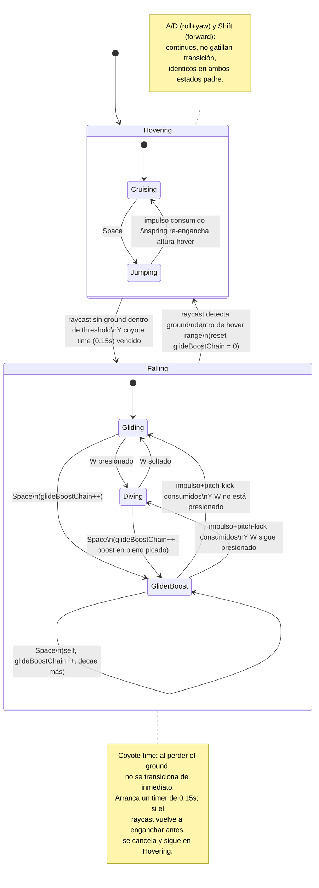

POC 2 — Floating Board FSM

## Objetivo

Implementar una **FSM anidada formal** sobre el `FloatingBoardController` ya validado en POC1, reemplazando los `if/else` dispersos (`isHovering`, gating de `pitchDown`, ramas de `Space` según contexto) por transiciones explícitas y guardadas (`TransitionTable`), usando el mismo patrón `BaseStateMachine<TState>` de proyectos anteriores — adaptado de cero para este repo (ver Notas de implementación).

Este POC busca resolver:
- Reemplazar el estado implícito (`isHovering: boolean` + banderas sueltas) por estados explícitos con `onEnter`/`onExit`.
- Dejar un punto de enganche limpio (`onStateChange`) para el futuro gestor de animaciones (POC3+) y para el HUD de debug.
- Documentar en un único lugar qué input produce qué transición, en vez de que quede repartido en el código.

Queda **fuera de alcance** de este POC: el jetpack (`B2`) y los estados a pie sin vehículo (`A1`/`A2`) — se documentan como roadmap más abajo, pero no se implementan todavía. Tampoco se aborda el gestor de animaciones real (POC1/POC2 usan box placeholder, sin modelo animado).

## Estructura de archivos

```
src/poc2-floating_board_fsm/
├── config.ts
├── board.base.ts                  ← Poc (build/dispose), orquesta scene/board/controller/hud
├── board.input.ts
├── board.hud.ts
├── board.controller.ts
├── poc2.md
├── utils/
│   └── utils.ts                   ← scene_builder (ground), board_character_builder (mesh + aggregate)
├── board-fsm/
│   ├── board.fsm.ts               ← padre (B1), decide Falling vs Hovering
│   ├── board.fsm.falling.ts       ← B1a
│   └── board.fsm.hovering.ts      ← B1b
├── abstract/
│   └── base-fsm.ts
└── contracts/
    └── ibase-fsm.ts
```

`board.main.ts` y `board.base.ts` del plan original se consolidaron en un único archivo (`board.base.ts`, clase `BoardBase implements Poc`) — no hay separación entre "loader del POC" y "dueño de las entidades". La construcción de mesh/aggregate/ground se extrajo a su vez a `utils/utils.ts`, dejando `board.base.ts` como puro orquestador (scene → board → controller → hud).

## Diagrama de estados



`Hovering` y `Falling` corresponden a `B1b` y `B1a` en el roadmap de más abajo — el board completo (`board.fsm.ts` + hijos) es el sub-árbol `B1`.

## Roadmap (fuera de alcance de este POC, documentado para no perder el diseño)

Jerarquía completa de estados del personaje, pensada para cuando exista una FSM de personaje por encima de la del board:

```
A — A pie
  A1 — On ground
  A2 — In the air
B — Sobre un artefacto
  B1 — Skateboard          ← esto es lo que implementa POC2
    B1a — Falling
    B1b — Hovering
  B2 — Jetpack
    B2a — Floating
```

No se crean archivos para `A1`/`A2`/`B2` en este POC — se agregan cuando haya comportamiento real que implementar, siguiendo el mismo patrón de carpetas que `B1`.

## Notas de implementación

- `abstract/base-fsm.ts` y `contracts/ibase-fsm.ts` se crean de cero para este repo — es un proyecto distinto al de POCs/proyectos anteriores, no se importa nada compartido entre repos.
- El patrón (`TransitionTable<TState>`, guards como `() => boolean | true`, `onEnter`/`onExit` abstractos) replica el de `BaseStateMachine` usado en el enemigo AI del repo anterior, adaptado sin dependencias externas.
- La lógica interna de cada guard/acción (raycast, timers, impulsos, fuerzas) se porta desde el `FloatingBoardController` de POC1, que ya está validado — este POC no reintroduce física nueva, sólo la reorganiza detrás de la FSM.
- El HUD (`board.hud.ts`) se suscribe a `onStateChange` de las 3 FSMs (padre + 2 hijos) — sin polling.
- A diferencia de POC1 (mesh armado a mano con `MeshBuilder`), en POC2 el mesh del board (y el del personaje/cápsula, para cuando se monten) se obtienen de un `AssetManager` compartido del repo. El `PhysicsAggregate` del board y del ground se crean en `board.base.ts`, igual que en POC1 se creaban junto al mesh — la diferencia es sólo de dónde sale la geometría, no de quién es dueño de la física.

## Progreso

- [x] **Paso 1** — Crear estructura de archivos vacía (`abstract/`, `contracts/`, `board-fsm/`).
- [x] **Paso 2** — Implementar `base-fsm.ts` + `ibase-fsm.ts`.
- [x] **Paso 3** — Implementar `board.fsm.ts` (padre) + `board.fsm.hovering.ts` + `board.fsm.falling.ts`.
- [ ] **Paso 4** — Portar guards y acciones desde `FloatingBoardController` (POC1) a `board.controller.ts`.
  - [x] **4a** — Física mínima, sin input: `PhysicsAggregate` del board, ground real, raycast (`isGroundDetected`) y fuerza de hover (spring-damper). El board cae desde el spawn elevado (`Falling`) y llega solo a `Hovering`. Confirmado funcionando.
  - [ ] **4b** — Input completo: roll/yaw, forward, pitchDown/Diving, jump/GliderBoost.
- [x] **Paso 5** — `board.hud.ts` — estado/sub-estado en pantalla vía `onStateChange`. Wireado en `board.base.ts`.
- [ ] **Paso 6** — Registrar POC2 en el selector de POCs (`board.base.ts` + registry lazy-load).