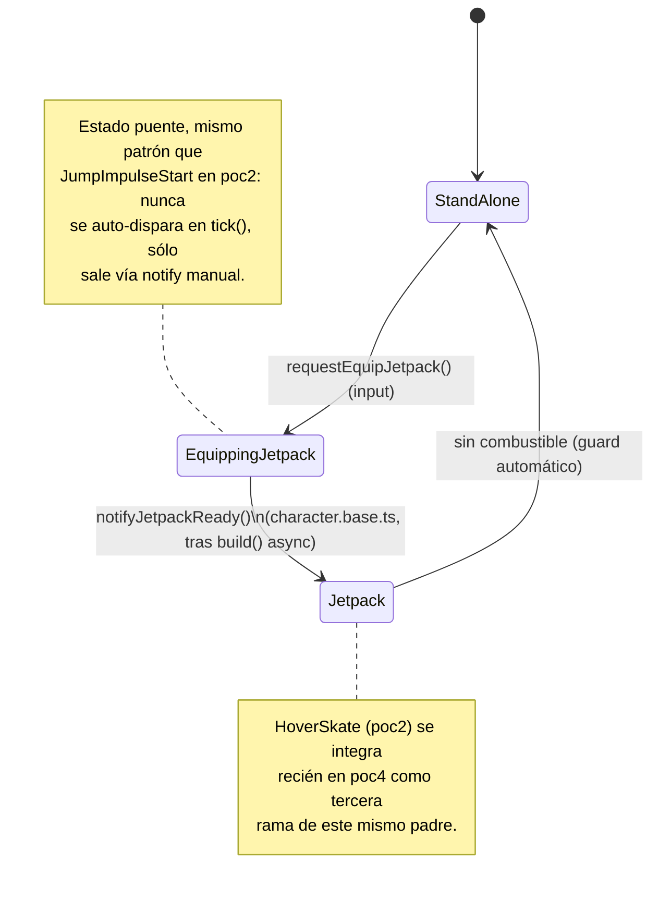
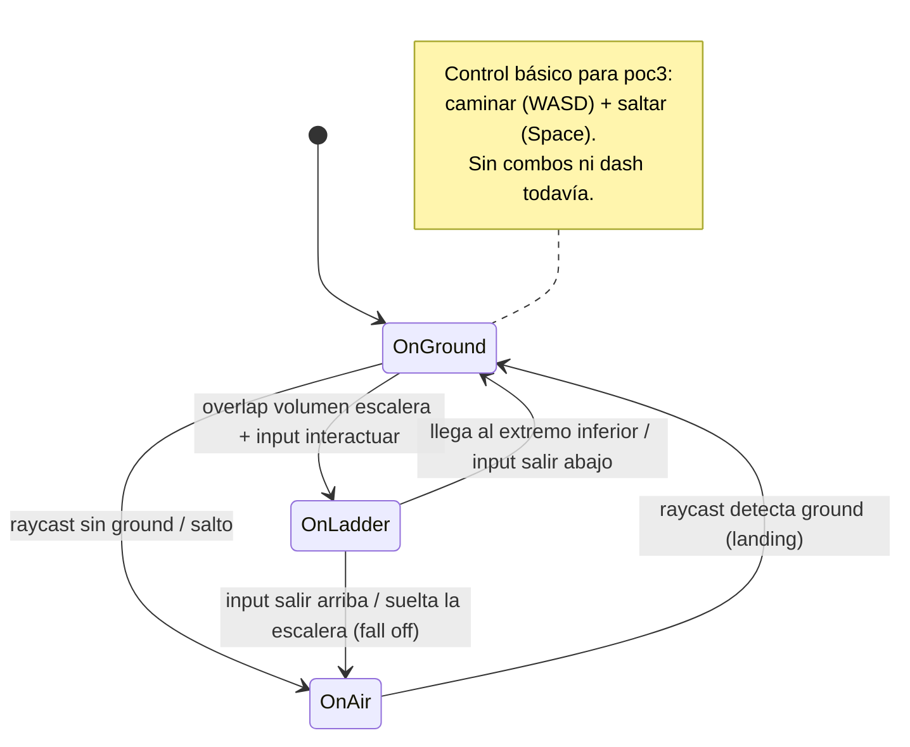
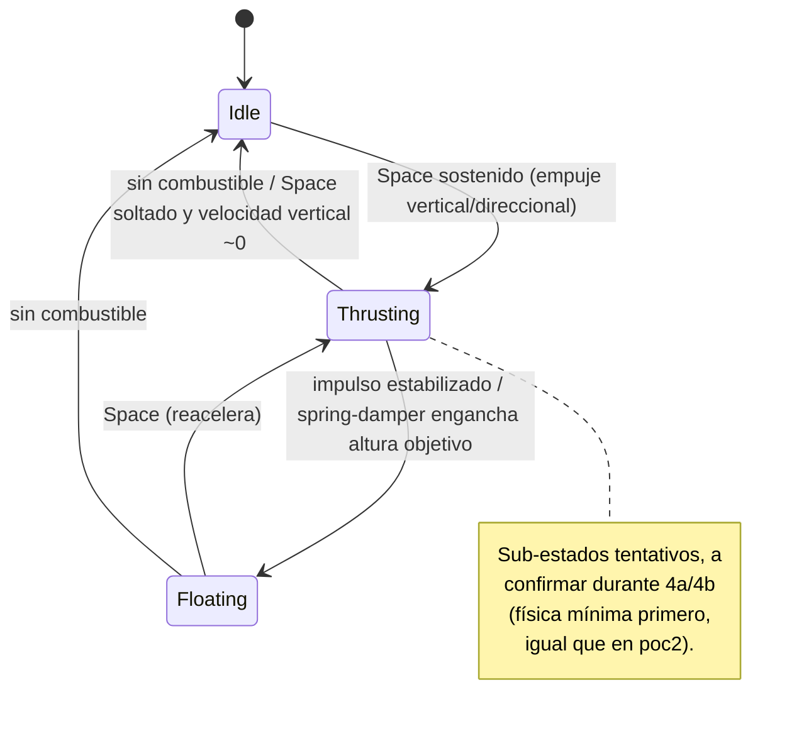

POC 3 — Character FSM (No Vehicle / Jetpack) + Strategy de Controllers

> **Estado de este documento:** borrador para debate. Antes de escribir código se busca
> validar el esquema de FSM, el contrato de strategy y la estructura de archivos.
> Hay una sección de **Puntos abiertos** al final con las decisiones que quedan pendientes
> de cerrar una vez que se comparta el código real de POC2 (`base-fsm.ts`, `board.fsm.ts`,
> `board.controller.ts`).

## Objetivo

Introducir una **FSM de personaje** por encima de lo que hasta ahora era sólo `BoardFsm`
(POC2), para soportar tres estados principales:

1. **StandAlone** — el personaje a pie, con sub-estados `OnGround` / `OnAir` / `OnLadder`.
2. **HoverSkate** — lo ya construido en POC2 (`BoardFsm` con `Hovering`/`Falling`). **No se
   reimplementa en POC3**, se integra en POC4.
3. **Jetpack** — nuevo, con física de vuelo propia y efectos (thruster), sub-estados a
   definir durante la implementación.

El cambio de fondo respecto a POC2 es que ahora el **controller deja de ser único**: cada
estado principal necesita su propio trío de controllers (física, input, animación), y esos
tríos se intercambian completos cuando cambia el estado principal — vía un patrón
**Strategy**, descartando y recreando (no hot-swap), siguiendo el mismo criterio ya usado
en el agachado de Space Freesbe (Havok no permite mutar shapes en caliente, así que se
recrea el `PhysicsAggregate` en vez de intentar mutarlo).

POC3 se da por **terminado** cuando:

- [ ] El estado `Jetpack` es funcional: física de vuelo + efectos (thruster).
- [ ] El estado `StandAlone` tiene un control básico (mínimo `OnGround`/`OnAir`, caminar y saltar).
- [ ] La transición entre `StandAlone` ⇄ `Jetpack` funciona, con handoff de transform sin salto visual.
- [ ] Todo lo anterior queda documentado en este archivo.

Queda **fuera de alcance**: integrar `HoverSkate` en esta FSM (POC4), y el detalle fino de
sub-estados de escalera (`OnLadder`) más allá de un placeholder funcional.

## Estructura de archivos (propuesta)

Nota: no hay `config.ts` local — se confirmó en el código real de POC2 que `generalConfig`
vive en `src/config.general.ts`, **compartido entre POCs** (a diferencia de la FSM/controllers,
que sí son aislados por POC). POC3 extiende ese mismo archivo con las secciones `jetpack`/
`noVehicle`.

```
src/poc3-jetpack_character_fsm/
├── character.base.ts              ← Poc (build/dispose), orquesta scene/fsm/strategy/hud
├── character.hud.ts
├── character.input.ts             ← CommandDispatcher de bajo nivel (captura teclas, agnóstico)
├── utils/
│   └── utils.ts                   ← scene_builder, character mesh builder (mismo rol que en poc2)
├── character-fsm/
│   ├── character.fsm.ts           ← padre nuevo (raíz): decide StandAlone / Jetpack / (HoverSkate en poc4)
│   ├── character.fsm.stand-alone.ts ← sub-fsm: OnGround / OnAir / OnLadder
│   └── character.fsm.jetpack.ts    ← sub-fsm: sub-estados de vuelo (ver más abajo, abierto)
├── strategies/
│   ├── contracts/
│   │   ├── ivehicle-strategy.ts    ← agrupa physics + input + animation, build/dispose/tick
│   │   ├── iphysics-controller.ts
│   │   ├── iinput-controller.ts    ← capa de "interpretación" (qué hace cada tecla en este estado)
│   │   └── ianimation-controller.ts
│   ├── stand-alone/
│   │   ├── stand-alone.physics.controller.ts
│   │   ├── stand-alone.input.controller.ts
│   │   └── stand-alone.animation.controller.ts
│   └── jetpack/
│       ├── jetpack.physics.controller.ts
│       ├── jetpack.input.controller.ts
│       ├── jetpack.animation.controller.ts
│       └── jetpack.thruster.ts     ← efecto visual, mismo rol que board.thruster.ts en poc2
├── abstract/
│   └── base-fsm.ts                 ← copiado/adaptado de poc2 (POCs aislados, sin import cruzado)
└── contracts/
    └── ibase-fsm.ts
```

Nota: se mantiene la convención de POC2 de que cada POC es autocontenido (no se importa
`base-fsm.ts` directamente desde la carpeta de poc2). Se duplica y adapta si hace falta.
**Punto abierto** si esto sigue siendo así o conviene promover `base-fsm.ts`/`ibase-fsm.ts`
a algo compartido entre POCs — ver Puntos abiertos.

## Diagrama de estados — raíz (`CharacterFsm`)



## Diagrama de estados — `StandAlone`



## Diagrama de estados — `Jetpack` (tentativo, abierto a debate)



## El contrato de Strategy

```ts
interface IVehicleStrategy {
  physics: IPhysicsController;
  input: IInputController;
  animation: IAnimationController;

  build(deps: VehicleStrategyDeps): Promise<void>;
  dispose(): void;
  tick(dt: number): void;

  // handoff: snapshot de transform/velocidad para pasarlo a la próxima strategy
  getTransformSnapshot(): TransformSnapshot;
  applyInitialState(snapshot: TransformSnapshot): void;
}
```

`CharacterFsm` (el padre nuevo) es quien posee la instancia de `IVehicleStrategy` activa.
En cada transición de estado principal:

1. Pide `getTransformSnapshot()` a la strategy saliente.
2. Llama `dispose()` sobre la saliente.
3. Construye la entrante (`build()`), le pasa `applyInitialState(snapshot)`.
4. Notifica `onStateChange` (para HUD y animation controllers que estén escuchando).

## Notas de implementación

- **Input de bajo nivel vs. interpretación por estado**: `character.input.ts` (el
  `CommandDispatcher`) sigue siendo único y agnóstico — sólo captura teclas/eventos, igual
  que en proyectos anteriores. Lo que cambia por estado es la **capa de interpretación**
  (qué acción dispara cada tecla), que vive dentro de cada `IInputController` de la
  strategy activa y se swapea junto con física y animación. Esto evita terminar con un
  dispatcher lleno de `if (mainState === 'jetpack')`.

- **Animation controller con escritura hacia la FSM**: a diferencia de POC2 (donde el
  animator sólo hacía polling de estado, sin referencia inversa), en POC3 el
  `IAnimationController` puede:
  - Leer el estado actual de la FSM (igual que antes).
  - **Escribir** de vuelta: forzar una transición al llegar a cierto frame de una
    animación, o poner la FSM en un estado de "reproduciendo sin interrupción" (animation
    lock) que bloquea transiciones disparadas por input hasta que la animación termine.
  - Esto es una extensión del patrón que ya se usa en el POC actual de la skater
    (estado intermedio `JumpImpulseStart` para sincronizar animación de salto con física) —
    acá se formaliza como parte del contrato en vez de resolverlo caso a caso.

- **Dispose/recreate, no hot-swap**: mismo criterio que la cápsula dinámica del agachado en
  Space Freesbe. Cambiar de `StandAlone` a `Jetpack` implica destruir el
  `PhysicsAggregate`/controller de uno y crear el del otro, no mutar el existente.

- **HUD extendido**: en POC1/POC2 el HUD mostraba estado/sub-estado vía `onStateChange`.
  Para POC3 necesita además mostrar valores de la strategy activa (velocidad, combustible
  del jetpack, etc.), no sólo el nombre del estado. Falta definir si esto es un stream
  separado (`onDebugValues`) al que cada `IPhysicsController` empuja, o si el HUD hace
  polling liviano de la strategy activa cada frame — **punto abierto**.

## Roadmap (fuera de alcance de este POC)

```
A — A pie                         ← esto es lo que implementa POC3 (StandAlone)
  A1 — On ground
  A2 — In the air
  A3 — On ladder
B — Sobre un artefacto
  B1 — Skateboard (poc2)          ← se integra en poc4
    B1a — Falling
    B1b — Hovering
  B2 — Jetpack                    ← esto es lo que implementa POC3
    B2a — Idle / Thrusting / Floating (tentativo)
```

En **POC4**: integrar `HoverSkate` (POC2) como tercera rama de `CharacterFsm`, reutilizando
`IVehicleStrategy` para envolver el `BoardFsm` + `board.controller.ts` existentes.

## AssetManager — cambio de arquitectura respecto a lo asumido antes

Se compartió `AssetManager` (`src/services/assets-manager.ts`, singleton estático). Esto
cambia dos supuestos que tenía este documento:

- **Ya no es "POCs aislados, todo local"** para la construcción de meshes/materiales/luces
  — `AssetManager` es un servicio único y compartido para **todo el proyecto** (ya tiene
  registradas claves de `board`/`character-capsule` que anticipan tanto poc2 como poc3).
  La regla de aislamiento sigue aplicando a la lógica (FSM, controllers), no a la
  construcción de assets.
- `character_builder()` en `utils/utils.ts` ya no crea mesh/cápsula "a mano" — pide
  `AssetManager.getMesh('character', ...)` (el GLB visual) y
  `AssetManager.getMesh('character-capsule', ...)` (la cápsula física, ya escalada según
  `generalConfig.playerConfig` dentro de `AssetManager`), y parentea el GLB a la cápsula
  para que siga su transform físico — mismo criterio que `AssetManager` usa internamente
  para pegar `tailMesh` a `boardMesh`.
- **Corregido un desacople en el `utils.ts` compartido**: la versión intermedia creaba un
  `characterMesh` suelto vía `MeshBuilder.CreateCapsule(...)` que no tenía relación ni con
  la cápsula física del `AssetManager` ni con el modelo visual — quedó de un borrador
  anterior sin adaptar del todo. Ya está corregido: `characterMesh` devuelto es la cápsula
  real del `AssetManager` (la que lleva el `PhysicsAggregate`).

## Punto abierto nuevo — carga de assets antes de `build()` — **decisión tomada, a confirmar**

`AssetManager.cargarTodo(canvas, scene)` es async y necesita `canvas` — pero
`character.base.ts` (`Poc.build(scene)`) sólo recibe `scene`. **Supuesto adoptado**: la
carga se dispara una sola vez al bootstrapear la app, antes del selector de POCs — no
dentro de cada `Poc.build()`. Por eso `Poc.build()` NO cambió de firma en POC3.
`character.base.ts` documenta este supuesto en un comentario explícito, y si no es así en
tu repo real (por ejemplo si cada POC dispara su propio `cargarTodo()`), `character_builder()`
va a tirar el error "`AssetManager: 'character' o 'character-capsule' no disponibles`" en
runtime — señal clara de que hay que revisar este punto. **Confirmame si el supuesto es correcto.**

## Punto abierto nuevo — animation groups por instancia en `AssetManager.getMesh()` — **resuelto**

`AssetManager.getMesh()` ahora devuelve `{ mesh, animationGroups }` en vez de sólo el mesh
— las animaciones clonadas por instancia ya no se descartan. `character_builder()` en
`utils.ts` las recibe una sola vez (junto con `characterMesh`/`characterAggregate`) y
`character.base.ts` las pasa por referencia a la strategy activa. Los animation controllers
(`StandAloneAnimationController`/`JetpackAnimationController`) las reciben ya listas por
constructor y sólo `stop()` en su `dispose()` — nunca las disponen, porque no son dueños:
el dueño es `character.base.ts`, que sí las dispone en su propio `dispose()` final.

**⚠️ Breaking change a tener en cuenta**: si `AssetManager.getMesh()` ya se usa en otro
lado del repo (poc2, para `'board'`, por ejemplo), esas llamadas hay que actualizarlas para
leer `.mesh` en vez de usar el resultado directo.

## Confirmado a partir del código real de POC2

- `generalConfig` es compartido (`src/config.general.ts`), no por-POC.
- Patrón deps-callback: ninguna FSM (padre o hija) conoce al controller/strategy
  directamente — sólo recibe funciones inyectadas por constructor (`XxxFsmDeps`).
- `true` (event-triggered) vs. guard-function no es intercambiable a gusto: transiciones
  que dependen de una condición continua (ground detection, combustible) van con guard;
  las que dependen de una acción puntual del jugador (saltar, boost, equipar) van con
  `true` + un método público `requestX()` como único punto de entrada.
- El padre siempre construye sus sub-FSMs en el propio constructor y les delega el
  `tick()` según su propio estado activo — mismo patrón para `CharacterFsm` con
  `standAloneSubFsm`/`jetpackSubFsm`.
- **`BoardInput` (raw input de POC2) NO es el dispatcher-con-interpretación-por-estado que
  habíamos imaginado.** Es sólo captura cruda de teclas + un par de flags edge-triggered
  (`consumeJumpRequest`), y el propio archivo aclara que es provisorio ("no usa el
  `CommandDispatcher` del juego todavía"). La traducción real "tecla → acción FSM" pasa
  *adentro de `BoardController.update()`* (`if (this.input.consumeJumpRequest()) this.fsm.requestJump()`),
  mezclada con la física — no en una clase de input separada. **Conclusión para POC3**: la
  separación formal en `IInputController` por strategy que pediste es una elevación real
  sobre POC2, no algo que ya esté resuelto ahí. `character.input.ts` (raíz, única instancia,
  captura cruda + edge-triggered) se mantiene igual de simple que `BoardInput`; lo nuevo es
  que la traducción "tecla → `fsm.requestX()`" se saca del controller de física y pasa a
  vivir en el `IInputController` de la strategy activa.
- **`BaseFsm` ya tiene `_isBlocking`/`isBlocking()`**, sin uso concreto todavía en POC2.
  Se propone reutilizarlo para dos cosas a la vez:
  - El *animation lock* del punto 4 (animator bloqueando transiciones mientras reproduce
    sin interrupción).
  - El *swap async* de strategy: al entrar a `Jetpack`, `CharacterFsm` puede setear
    `_isBlocking = true` hasta que `character.base.ts` termine el `build()` async de la
    strategy entrante, y recién ahí destrabarlo. Evita el estado intermedio en que la FSM
    ya dice `"Jetpack"` pero la strategy todavía no existe.
- Ajuste a la tabla de transiciones raíz propuesta — **revisado** tras ver
  `BoardFsmHovering` real (ver hallazgo `JumpImpulseStart` más abajo):
  ```ts
  type CharacterMainState = "StandAlone" | "EquippingJetpack" | "Jetpack";

  interface CharacterFsmDeps {
    hasFuel: () => boolean;              // vive en el padre, igual que isGroundDetected en BoardFsmDeps
    onEnterEquippingJetpack: () => void; // dispara character.base.ts a arrancar el build() async
    onEnterStandAlone: () => void;
    // + deps de las sub-fsms (stand-alone / jetpack), a definir con el código real de esas hijas
  }

  transitions = {
    StandAlone:        { EquippingJetpack: true },                 // requestEquipJetpack()
    EquippingJetpack: { Jetpack: true },                          // notifyJetpackReady(), manual
    Jetpack:          { StandAlone: () => !this.deps.hasFuel() },  // guard automático, dispose es sync
  };
  ```
  **Confirmado:**
  - Único punto de entrada de input: `requestEquipJetpack()` en `CharacterFsm`, igual
    patrón que `requestJump()` en `BoardFsm` — el input controller no llama `setState()`
    directo.
  - `hasFuel()` vive en `CharacterFsmDeps` (padre), no en `JetpackFsm` (hija) — mismo
    criterio que `isGroundDetected`/`groundLostElapsed` en `BoardFsmDeps`.

  **Hallazgo — reemplaza la idea de `_isBlocking`:** `BoardFsmHovering` real resuelve el
  patrón "esperar una señal externa antes de completar la transición" con un **estado
  puente** (`JumpImpulseStart`) cuya única salida es `true` (nunca se auto-dispara en
  `tick()`), y un método público (`notifyJumpImpulseFrame()`) que sólo el animator llama.
  Es el mismo problema que el swap async de strategy — se resuelve igual, con
  `EquippingJetpack` como estado puente y `notifyJetpackReady()` llamado por
  `character.base.ts` al terminar el `build()`. No hace falta usar `_isBlocking` (que sigue
  sin uso concreto ni en POC2 ni, por ahora, en este diseño).

## Decisiones descartadas

**State pattern para los macro-estados (`ICharacterMainState` con `enter/tick/exit/getHUDLabel/dispose`), evaluado y descartado por ahora.** Se llegó a implementar (`character.state.ts` + una clase por macro-estado + una capa extra `IStandAloneSubState` para los sub-estados de a pie) y se encontraron 3 problemas concretos, no sólo de estilo:
- Doble-inicialización real: llamar `enter()` del estado inicial desde el constructor de `CharacterFsm` disparaba `_swapToStandAlone()` antes de que `character.base.ts` terminara de asignar `this.fsm`, corriendo en paralelo con el `await this._swapToStandAlone()` explícito de `build()`.
- El HUD dejó de reaccionar a cambios de sub-estado (sólo quedó escuchando el macro-estado).
- 3 `as any` para acceder a métodos específicos de `StandAloneState` a través de la interfaz genérica — la interfaz no puede expresar métodos que sólo tiene un estado sin ensancharse para todos.
- La capa `IStandAloneSubState` (OnGround/JumpImpulseStart/OnAir como clases) quedó vacía — la lógica real (raycast, WASD, impulso) sigue en `StandAlonePhysicsController`, sin mover.

El único beneficio real (evitar que `CharacterFsmDeps` crezca con una entrada por cada dep de cada sub-fsm) es genuino pero todavía no duele con sólo 2 macro-estados. **Se mantiene el diseño actual** (`BaseFsm`/`TransitionTable` en los dos niveles, deps por constructor) — revisar esta decisión si `CharacterFsmDeps` se vuelve difícil de leer más adelante (ej. al integrar HoverSkate en poc4).

## Puntos abiertos (a resolver antes/durante implementación)

1. **Sub-estados de `Jetpack`**: el diagrama es tentativo. Falta confirmar si conviene
   algo más simple (sólo `Off`/`On`) para el alcance mínimo de POC3, dejando
   `Thrusting`/`Floating` como refinamiento posterior.
2. **Mecanismo exacto de handoff** (`getTransformSnapshot`/`applyInitialState`): confirmar
   qué incluye el snapshot (¿sólo transform+velocidad lineal, o también angular/rotationQuaternion,
   dado el bug ya conocido de Havok pisando `rotationQuaternion`?). ¿Se toma en
   `onEnterEquippingJetpack` (antes de empezar el build) o recién al llamar
   `notifyJetpackReady`?
3. **`base-fsm.ts` compartido o duplicado** entre POC2 y POC3 — mantener la convención de
   POCs aislados o promoverlo a un módulo común ahora que hay 3 niveles de FSM en juego.
4. **HUD**: stream de debug values vs. polling — ver nota arriba.
5. Naming definitivo de interfaces/contratos (`IVehicleStrategy` es tentativo).
6. Falta ver cómo se resuelve en la práctica la separación input crudo (`character.input.ts`,
   único, edge-triggered como `BoardInput`) vs. interpretación por strategy
   (`IInputController.tick()` llamando `fsm.requestX()`) — POC2 no tiene ejemplo real de
   esto último para calcar, así que se diseña de cero en POC3.

## Progreso

- [x] **Paso 1** — Validar este documento (esquema de FSM, contrato de strategy, estructura de archivos).
- [x] **Paso 2** — Código real de POC2 compartido y confirmado (`base-fsm.ts`, `ibase-fsm.ts`, `board.fsm.ts`, `board.fsm.hovering.ts`, `board.fsm.falling.ts`, `board.controller.ts`, `board.input.ts`, `board.hud.ts`, `board.base.ts`).
- [x] **Paso 3** — Estructura de archivos creada (`create-poc3-structure.sh`).
- [x] **Paso 4** — `character.fsm.ts` (padre, con estado puente `EquippingJetpack`) + `character.fsm.stand-alone.ts` (alcance mínimo: sólo `OnGround`).
- [x] **Paso 5** — Strategy `StandAlone` mínima: mover con WASD sobre la capsule compartida (sin salto todavía).
- [x] **Paso 6** — `character.fsm.jetpack.ts` (alcance mínimo: un solo estado `On`) + strategy `Jetpack` mínima: empuje vertical con Space + tracking de combustible (`hasFuel()`).
- [x] **Paso 7** — Transición `StandAlone` ⇄ `Jetpack` funcional de punta a punta: `requestEquipJetpack()` → `EquippingJetpack` → swap async de strategy → `notifyJetpackReady()` → `Jetpack`; vuelta automática por guard de combustible. **No hace falta handoff de transform** — `characterMesh`/`characterAggregate` son compartidos y únicos, a diferencia de HoverSkate en poc4 donde sí habrá un mesh de board separado.
- [x] **Paso 7.5** — Integración con `AssetManager` real: `character_builder()` pide `character`/`character-capsule` al `AssetManager` (en vez de crear meshes sueltos), parenteando el GLB visual a la cápsula física. `AssetManager.getMesh()` corregido para devolver también los `AnimationGroup` clonados por instancia (antes se descartaban). Animation controllers ahora reciben esas animaciones ya listas por constructor, sin cargar/clonar nada ellos mismos.
- [ ] **Paso 8** — `character.hud.ts` extendido con telemetría (combustible, velocidad) — por ahora sólo muestra estado/sub-estado.
- [ ] **Paso 9** — `jetpack.thruster.ts` (efecto visual) — deferido a propósito, según lo acordado.
- [ ] **Paso 10** — Sub-estados finos de `StandAlone` (`OnAir`, `OnLadder`) y `Jetpack` (`Idle`/`Thrusting`/`Floating`), una vez validado el esqueleto mínimo.
- [ ] **Paso 11** — Registrar POC3 en el selector de POCs.
- [ ] **Paso 12** — Confirmar el supuesto de cuándo se llama `AssetManager.cargarTodo()` (bootstrap único vs. por-POC) — ver "Punto abierto — carga de assets antes de build()".